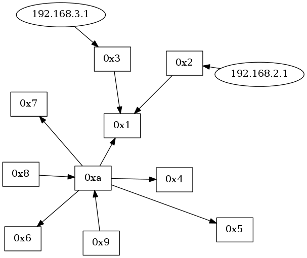

# レポート課題

## 課題

* topology を改造し、スイッチに加えて
ホストの接続関係を表示するコントローラを作る
* パケットを出したホストの IP アドレスを  楕円で表示

## ソースコード

### lib/view/graphviz.rb

In this file, the following code is added to the function `update()`:

```ruby
topology.hosts.each do |host|
  mac_address, _ip_address, dpid, port_no = *host
  gviz.add_nodes(_ip_address.to_s, shape: 'ellipse')
  next unless nodes[dpid]
  gviz.add_edges _ip_address.to_s, nodes[dpid]
end
```

after drawing all switches.

The code is simply fetch all hosts' information add get the IP address of it, and then ignore those host that there are no corresponding switch that the host is supposed to add to. Lastly, link the host to switch.

## 動作確認

Fist, create the topology manually:

```
vswitch { dpid '0x1' }
vswitch { dpid '0x2' }
vswitch { dpid '0x3' }
vswitch { dpid '0x4' }
vswitch { dpid '0x5' }
vswitch { dpid '0x6' }
vswitch { dpid '0x7' }
vswitch { dpid '0x8' }
vswitch { dpid '0x9' }
vswitch { dpid '0xa' }

link '0x1', '0x2'
link '0x1', '0x3'
link '0xa', '0x1'
link '0xa', '0x4'
link '0xa', '0x5'
link '0xa', '0x6'
link '0xa', '0x7'
link '0xa', '0x8'
link '0xa', '0x9'

vhost('host2') { ip '192.168.2.1' }
vhost('host3') { ip '192.168.3.1' }
vhost('host4') { ip '192.168.4.1' }
vhost('host5') { ip '192.168.5.1' }
vhost('host6') { ip '192.168.6.1' }
vhost('host7') { ip '192.168.7.1' }
vhost('host8') { ip '192.168.8.1' }
vhost('host9') { ip '192.168.9.1' }

link 'host1', '0x1'
link 'host2', '0x2'
link 'host3', '0x3'
link 'host4', '0x4'
link 'host5', '0x5'
link 'host6', '0x6'
link 'host7', '0x7'
link 'host8', '0x8'
link 'host9', '0x9'
```

, and then start the controller.

We can find the initialized topology is:


Since there are many hosts, we can first try to send packet from host2 to host3.

```bash
$ ./bin/trema send_packets -s host2 -d host3
```

The result is shown as bellow:


Next, we try the reverse direction, which is from host3 to host2

```bash
$ ./bin/trema send_packets -s host3 -d host2
```

, and the result becomes:



Now we can try to let host 4~9 send packets to host2

```bash
$ for i in {4..9}; do ./bin/trema send_packets -s host$i -d host2; done
```

After sending packet, the topology becomes:


But what will happened if we stop the switch `0x1`?

```bash
$ ./bin/trema stop 0x1
```

Since the `0x1` is down, `0x2` and `0x3` is no switch connected to, but `host2` and `host3` still connect to `0x2` and `0x3` respectively.


Finally, we restart the switch `0x1` and the topology is shown bellow:


